# PHÁT TÍN HIỆU ASK SỬ DỤNG VI XỬ LÝ STM32F103C8T6 

**Course: Wireless Communications - ET3180**

**Lecturer: Nguyen Van Duc**

**School: Hanoi University of Science and Technology - HUST**


**Students: Nguyen Ho Trieu Duong - 20224280**

**Created: Tue 23 Dec 2025 10:38:30 Hanoi, Vietnam**


*Dự án này tập trung vào việc hiện thực hóa phương thức điều chế ASK (Amplitude Shift Keying) - cụ thể là biến thể Unipolar ASK (OOK - On-Off Keying) - sử dụng vi điều khiển STM32F103C8T6. Hệ thống cho phép truyền tải dữ liệu văn bản từ máy tính qua giao tiếp UART, sau đó điều chế thành tín hiệu xung PWM tần số cao để phát đi qua các kênh truyền dẫn vật lý. Đây là mô hình minh họa đơn giản cho nguyên lý điều chế tín hiệu số cơ bản.*


## 1. Giới thiệu chung về ASK.

ASK (Amplitude Shift Keying) — hay còn gọi là Điều chế khóa dịch biên độ — là một phương pháp điều chế tín hiệu số vào sóng mang cao tần bằng cách thay đổi biên độ của sóng mang đó. Hiểu đơn giản, chúng ta dùng các mức biên độ (độ mạnh yếu của sóng) khác nhau để đại diện cho các bit dữ liệu 0 và 1.

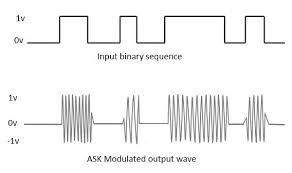
### 1.1 Nguyên lý cơ bản của ASK 

Tín hiệu ASK có thể được mô tả bằng công thức toán học tổng quát:

$$s(t) = A_i \cos(2\pi f_c t)$$

Trong đó:

- $A_i$ là biên độ thay đổi tùy thuộc vào dữ liệu số đầu vào.

- $f_c$ là tần số của sóng mang (không đổi).

Khi dữ liệu nhi phân là 1, sóng mang được phát đi với một biên độ nhất định. Khi dữ liệu là 0, sóng mang sẽ có biên độ thấp hơn hoặc bằng không.


### 1.2. Ưu và nhược điểm của ASK 


|Đặc điểm	| Chi tiết|
|-----------|----------|
|Ưu điểm	| Cấu trúc mạch điện đơn giản, chi phí thấp, yêu cầu băng thông thấp hơn so với FSK.
|Nhược điểm	| Rất nhạy cảm với nhiễu: Vì nhiễu thường tác động trực tiếp vào biên độ sóng, dẫn đến việc giải mã sai dữ liệu.
|Hiệu suất	| Hiệu suất năng lượng không cao bằng các phương pháp điều chế khác như PSK hay QAM.


Mặc dù có nhược điểm chính là nhạy cảm với nhiễu, ASK vẫn được sử dụng rộng rãi nhờ sự đơn giản. Ví dụ như trong:
- Sợi quang: Sử dụng OOK để bật/tắt tia laser truyền dữ liệu tốc độ cao.

- Mạng không dây tầm ngắn: Chìa khóa xe hơi, cửa cuốn, các module cảm biến không dây giá rẻ.

- RFID: Thẻ từ đọc dữ liệu ở khoảng cách gần.


### 1.3. Các loại điều chế ASK phổ biến

Dựa vào cách phân chia mức biên độ, chúng ta có các loại điều chế biên độ chính sau:

#### a. OOK (On-Off Keying)

Đây là trường hợp đơn giản và phổ biến nhất của ASK:

- Khi bit dữ liệu nhị phân có giá trị là 1, Sóng mang được phát đi với biên độ tối đa (On).

- Ngược lại, khi bit dữ liệu nhị phân có giá trị là 0, không có sóng mang nào được phát đi (Off).

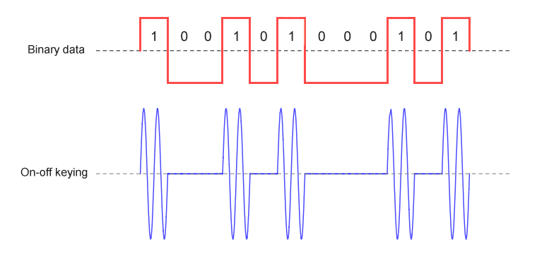


#### b. M-ary ASK

Thay vì chỉ có hai mức (0 và 1), phương thức điều chế này sử dụng nhiều mức biên độ khác nhau để truyền tải nhiều bit trên một biểu tượng (symbol).

Ví dụ tiêu biểu nhất là 4-ASK. Có 4 mức biên độ khác nhau của sóng mang, mỗi mức đại diện cho 2 bit dữ liệu nhị phân (00, 01, 10, 11)

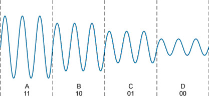

## 2. Yêu cầu bài toán và module phần cứng.

### 2.1. Giới thiệu tổng quan

Dự án này là một phần của môn học Thông tin Vô tuyến, tập trung vào việc hiện thực hóa lý thuyết điều chế số vào phần cứng thực tế. Mục tiêu chính là xây dựng một bộ phát dữ liệu sử dụng phương pháp điều chế ASK/OOK (Amplitude Shift Keying / On-Off Keying) trên nền tảng vi điều khiển STM32F103C8T6 (Blue Pill).

Hệ thống cho phép người dùng nhập dữ liệu từ máy tính thông qua giao thức UART, sau đó dữ liệu sẽ được đóng gói thành các khung tin (frames) và truyền đi liên tục dưới dạng tín hiệu đã được điều chế. 

Một số chức năng và tiêu chuẩn mà sinh viên đặt ra cho dự án lần này:

- Giao tiếp UART: Hệ thống có thể nhận chuỗi văn bản (message) từ máy tính thông qua các bộ chuyển đổi USB-to-Serial hoặc các phần mềm Terminal (PuTTY, Tera Term, Hercules).

- Điều chế dữ liệu: Chuyển đổi dữ liệu từ dạng chuỗi văn bản về dạng nhị phân theo chuẩn ASCII, sau đó chuyển đổi dữ liệu nhị phân đó thành tín hiệu điều chế dạng OOK.

- Có khả năng cập nhật dữ liệu động: Người dùng có thể thay đổi nội dung này bất cứ lúc nào qua giao tiếp UART giữa máy tính và vi điều khiển. 


### 2.2 Phần cứng sử dụng: 

Trong dự án này, STM32 Blue Pill đóng vai trò là "bộ não" điều khiển toàn bộ quá trình xử lý dữ liệu và điều chế tín hiệu. Nó được ưa chuộng trong các dự án viễn thông nhờ tốc độ xử lý vượt trội và sự ổn định của lõi ARM 32-bit.

- Nhờ vi xử lý ARM Cortex-M3 với xung nhịp tối đa 72 MHz, với tốc độ này, việc xử lý khung dữ liệu và điều khiển các chân tín hiệu diễn ra cực kỳ chính xác, không bị trễ như các dòng vi điều khiển 8-bit cũ.

- Điện áp hoạt động 3.3V , cùng với bộ nhớ 64KB Flash (lưu trữ code) và 20KB SRAM (lưu trữ tạm thời chuỗi tin nhắn nhận từ UART).

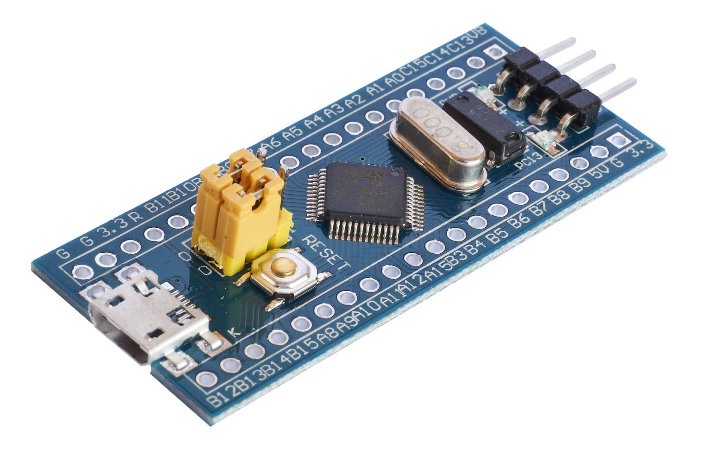


Để có thể giải quyết bài toán đặt ra, STM32 tận dụng tối đa 3 khối ngoại vi quan trọng với các chức năng cốt lõi như sau:

#### a. Giao tiếp UART
UART là giao thức truyền thông song song, phi đồng bộ. Vi điều khiển sử dụng giao thức giao tiếp này để nhận và truyền dữ liệu từ Terminal thông qua 2 đường dây: Tx và Rx. Cả 2 thiết bị phải thiết lập cùng Baud rate.

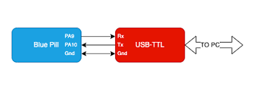

Giao tiếp UART sử dụng chế độ Ngắt (Interrupt) để nhận dữ liệu. Khi nhận được ký tự kết thúc là dấu chấm (.), nó sẽ cập nhật nội dung tin nhắn mới vào biến message. Điều này giúp hệ thống linh hoạt, không cần nạp lại code hoặc chỉnh sửa mã nguồn khi muốn đổi nội dung truyền.

#### b. Bộ tạo sóng mang PWM (TIM2)
Bộ tạo sóng mang PWM (TIM2): Do vi điều khiển Blue Pill không được trang bị các bộ DAC có sẵn nên sóng mang không phải là một sóng sin thuần túy mà là một chuỗi xung vuông được tạo ra bằng kỹ thuật PWM (Pulse Width Modulation) thông qua bộ định thời Timer 2 (TIM2). Cụ thể:

- Sóng mang được tạo ra tại chân PA0 (tương ứng với TIM2_CH1).

- Tần số sóng mang được thiết lập bên trong mã nguồn: Giá trị mặc định là 1 kHz. Dù 1kHz là khá thấp so với thực tế, nhưng trong mô phỏng hoặc thí nghiệm cơ bản, nó giúp dễ dàng quan sát dạng sóng trên Oscilloscope.

- Việc điều chế được thực hiện bằng cách khi bit dữ liệu nhận được là 1, bật PWM với Duty Cycle 50%. Còn khi bit dữ liệu là bit 0, ta tắt hoàn toàn sóng mang. 


#### c. GPIO Output Pins

- Chân PA0 (PWM Output - Sóng mang điều chế): Đây là chân quan trọng nhất, phát tín hiệu đã được điều chế. Chân này truyền sóng mang ở tần số 1kHz khi truyền bit '1' và đứng yên ở mức 0 khi truyền bit '0'.

- Chân PA5: chân này hoạt động như 1 chân truyền tín hiệu Logic thuần túy, giúp so sánh tín hiệu trên Oscilloscope. Kênh 1 đo PA5 (để biết bit đang truyền là gì) và Kênh 2 đo PA0 (để thấy sóng mang được chèn vào bit đó như thế nào).


#### d. Các modul hỗ trợ khác

Để hoàn thiện hệ thống và nạp code cho STM32 Blue Pill, bạn cần hai công cụ hỗ trợ quan trọng: ST-Link V2 (để nạp/gỡ lỗi) và CH340 USB-to-TTL (để giao tiếp UART).

- Module nạp ST-Link V2 giúp đưa mã nguồn từ máy tính vào bộ nhớ Flash của STM32. Nó chuyển file mã nguông thực thi (định dạng .hex hoặc .bin) từ phần mềm vào vi điều khiển. Ngoài ra, nóc còn giúp Cho phép ta chạy từng dòng code, xem giá trị các biến và trạng thái thanh ghi trong thời gian thực.


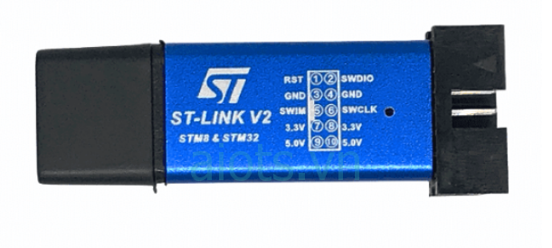


- Module UART CH340 (USB to TTL): CH340 đóng vai trò là "cổng giao tiếp" để bạn nhập nội dung tin nhắn từ bàn phím máy tính và gửi tới STM32, đồng thời quan sát trạng thái tin nhắn đang gửi. Nó có thể chuyển đổi tín hiệu USB từ máy tính thành tín hiệu UART (mức logic TTL 3.3V/5V) mà STM32 có thể hiểu được.

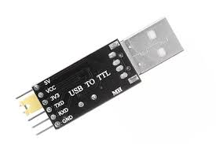

## 3. Thiết kế kiến trúc và lắp ráp mạch.

### 3.1. Sơ đồ khối chức năng và kiến trúc mã nguồn

Hệ thống bao gồm 3 khối chính:

- Khối giao diện (PC & UART CH340): Nơi người dùng nhập thông điệp. Dữ liệu được chuyển từ chuẩn USB sang TTL để đi vào vi điều khiển.

- Khối xử lý trung tâm (STM32 Blue Pill): Thực hiện nhận dữ liệu, đóng gói khung tin (Frame) và tạo tín hiệu điều chế ASK.

- Khối nạp và gỡ lỗi (ST-Link V2): Cầu nối để nạp chương trình và giám sát hệ thống.


Mã nguồn được tổ chức dựa trên kiến trúc hướng sự kiện (Event-driven) kết hợp với vòng lặp:

- Tầng ngoại vi (HAL Layer): Cấu hình UART, Timer (PWM) và GPIO.

- Tầng xử lý ngắt: HAL_UART_RxCpltCallback xử lý việc thu nhận tin nhắn từ người dùng mà không làm gián đoạn quá trình phát.

- Tầng điều chế: Các hàm Send_Bit, Send_Byte, Send_Frame thực hiện logic logic hóa dữ liệu thành tín hiệu vật lý.


### 3.2. Hardware Setup (sơ đồ kết nối)

Bảng dưới đây là danh sách kết nối chân cho các linh kiện tương ứng với chân của vi điều khiển STM32: 

|STT|	Thiết bị|	Chân thiết bị|	Chân STM32|	Ghi chú|
|---|-----------|----------------|------------|--------|
1	|CH340	|  TXD	|PA3 (RX2)	|Nhận lệnh từ máy tính
|||            RXD	|PA2 (TX2)	|Phản hồi trạng thái lên máy tính
2	|ST-Link	|SWDIO / SWCLK	|PA13 / PA14	|Giao diện nạp code
3|Oscilloscope| CH1|PA5|Quan sát dữ liệu gốc|
|||CH2|PA0|Quan sát sóng mang điều chế|


Sơ đồ kết nối được trình bày qua ảnh dưới đây. Có thể thấy tín hiệu sóng mang trước khi quan sát bằng Oscilloscope được đi qua bộ lọc RC đơn giản để biến xung vuông thành sóng sin. 

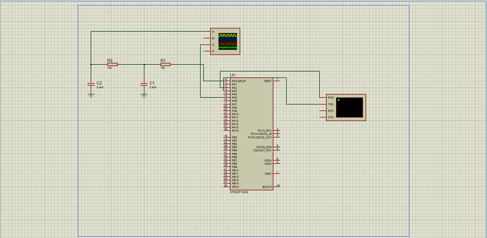


### 3.3. Lập trình mã nguồn 

#### a. Cấu hình ngoại vi
Trước khi viết các hàm điều chế, vi điều khiển cần được thiết lập các thông số vật lý thông qua công cụ STM32CubeMX:

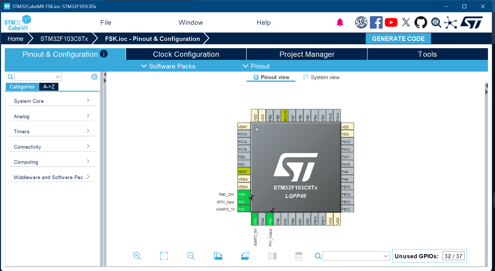

- Cấu hình các chân GPIO cho từng chức năng dựa trên thông số mặ định của nhà sản xuất: PA0 là đầu ra của Timer 2 -Channel 1, các chân PA2 và PA3 lần lượt là chân truyền và nhận dữ liệu khi giao tiếp USART. Chân PA5 đóng vai trò truyền tín hiệu nhị phân. 

- UART2 (Asynchronous): * Baudrate: 115200 bps. Sử dụng Chế độ: Interrupt (Ngắt) để nhận dữ liệu từ module CH340 mà không làm treo chương trình chính.

- Timer 2 (PWM Generation):Tần số sóng mang được điều chỉnh linh hoạt qua thanh ghi ARR (Auto-reload Register). Cấu hình Kênh 1 (PA0) ở chế độ PWM Generation CH1.


#### b. Thiết kế Cấu trúc Khung dữ liệu (Data Frame Design)


Để bộ thu có thể nhận diện chính xác dữ liệu trong môi trường vô tuyến đầy nhiễu, quy trình lập trình tuân thủ cấu trúc gói tin nghiêm ngặt:


|Giai đoạn	|Giá trị	|Mục đích kỹ thuật|
|-----------|-----------|-----------------|
Preamble	|0xAA (10101010)	|Giúp bộ thu xác định ngưỡng điện áp (Threshold) và đồng bộ nhịp bit.|
Start Byte	|0x55 (01010101)	|Báo hiệu kết thúc đồng bộ và bắt đầu dữ liệu thực.
Payload	|Chuỗi ký tự	|Dữ liệu văn bản người dùng nhập từ UART.
Stop Byte	|0x0D (\r)	|Đánh dấu kết thúc một khung tin để bộ thu nghỉ.


```C
#define PREAMBLE  0xAA
#define START    0x55
#define STOP     0x0D
```


#### c. Thuật toán điều chế Unipolar ASK - OOK 

Quy trình xử lý từ một ký tự văn bản ra sóng điện từ được chia thành 3 cấp độ hàm như sau:

- Hàm gửi bit: Kiểm tra giá trị bit. Nếu Bit = 1, bật xung PWM (50% duty cycle) tại chân PA0 và kéo chân PA5 lên mức cao. Nếu Bit = 0, tắt xung PWM và kéo chân PA5 xuống mức thấp. Sử dụng hàm HAL_Delay(bit_time_ms) để giữ trạng thái trong đúng 10ms (100 bps)

```C
void Send_Bit_Unipolar_ASK(uint8_t bit, uint32_t bit_time_ms)
{
    uint32_t period = __HAL_TIM_GET_AUTORELOAD(&htim2);

    if (bit)
    {
        // Unipolar
        HAL_GPIO_WritePin(GPIOA, GPIO_PIN_5, GPIO_PIN_SET);
        // ASK
				HAL_TIM_PWM_Start(&htim2, TIM_CHANNEL_1);
        __HAL_TIM_SET_COMPARE(&htim2, TIM_CHANNEL_1, period / 2);
    }
    else
    {
        HAL_GPIO_WritePin(GPIOA, GPIO_PIN_5, GPIO_PIN_RESET);
        __HAL_TIM_SET_COMPARE(&htim2, TIM_CHANNEL_1, 0);
				HAL_TIM_PWM_Stop(&htim2, TIM_CHANNEL_1);
    }

    HAL_Delay(bit_time_ms);
}
```


- Hàm gửi byte: Sử dụng vòng lặp 8 lần để tách một ký tự thành các bit đơn lẻ. Quy trình thực hiện gửi từ bit có trọng số cao nhất (MSB) đến bit thấp nhất (LSB) bằng phép dịch bit.

```C
void Send_Byte_Unipolar_ASK(uint8_t byte, uint32_t bit_time_ms)
{
    for (int i = 7; i >= 0; i--)   // MSB tru?c
    {
        uint8_t bit = (byte >> i) & 0x01;
        Send_Bit_Unipolar_ASK(bit, bit_time_ms);
    }
}
```


- Hàm gửi Frame dữ liệu: Tổ hợp các Byte theo đúng cấu trúc khung dữ liệu đã thiết kế ở trên. Hàm này gọi liên tiếp các hàm gửi Preamble, Start, sau đó dùng vòng lặp gửi từng ký tự trong chuỗi message và kết thúc bằng Stop byte.

```C
void Send_Frame(char *text)
{
    Send_Byte_Unipolar_ASK(PREAMBLE, 10);
    Send_Byte_Unipolar_ASK(START, 10);

    while (*text)
        Send_Byte_Unipolar_ASK(*text++, 10);

    Send_Byte_Unipolar_ASK(STOP, 10);
		HAL_GPIO_WritePin(GPIOA, GPIO_PIN_5, GPIO_PIN_RESET);
    __HAL_TIM_SET_COMPARE(&htim2, TIM_CHANNEL_1, 0);
		HAL_TIM_PWM_Stop(&htim2, TIM_CHANNEL_1);
}
```


#### d. Cơ chế nhận dữ liệu tự động qua UART

Quy trình này cho phép hệ thống cập nhật nội dung truyền mà không cần khởi động lại:

- Khi có 1 byte truyền đến từ CH340, hàm HAL_UART_RxCpltCallback tự động được triệu gọi.

- Kiểm tra điều kiện của thông điệp: Nếu ký tự nhận được là dấu chấm (.), hệ thống coi như kết thúc chuỗi và sao chép dữ liệu vào bộ đệm chính (message). Nếu chưa phải dấu chấm, dữ liệu được tích lũy vào bộ đệm tạm rx_buffer.

- Cuối hàm khởi tạo, gọi Gọi HAL_UART_Receive_IT để thực hiện ngắt (Interupt) của vi điều khiển.

```C
void HAL_UART_RxCpltCallback(UART_HandleTypeDef *huart)
{
    if (huart->Instance == USART2)
    {
        if (uart_rx_char == '.')
        {
            uart_rx_buf[uart_rx_idx] = '\0';

            if (uart_rx_idx > 0)
            {
                strcpy(message, uart_rx_buf);   // c?p nh?t message
                new_message_flag = 1;
            }

            uart_rx_idx = 0;
        }
        else
        {
            if (uart_rx_idx < RX_BUF_SIZE - 1)
            {
                uart_rx_buf[uart_rx_idx++] = uart_rx_char;
            }
        }

        HAL_UART_Receive_IT(&huart2, &uart_rx_char, 1);
    }
}

```


#### e. Vòng lặp thực thi chính 

Trong hàm main, sau khi khởi tạo các ngoại vi, vi điều khiển thực hiện một vòng lặp vô hạn:

- Liên tục gọi hàm Send_Frame(message).

- Nghỉ một khoảng thời gian ngắn giữa các khung (Inter-frame space) để bộ thu có thời gian xử lý.

- Nhờ cơ chế ngắt, việc phát sóng diễn ra liên tục, nhưng bất cứ khi nào người dùng gủi thông điệp mới, nội dung message sẽ được thay đổi "ngay tức thì".


```C

while (1)
  {
    if (new_message_flag)
    {
        uint8_t var1[] = ">>> NEW MESSAGE RECEIVED <<<\r\n";
        HAL_UART_Transmit(&huart2, var1, strlen((char*)var1), HAL_MAX_DELAY);
        new_message_flag = 0;
				HAL_UART_Transmit(&huart2,
                          (uint8_t*)message,
                          strlen(message),
                          HAL_MAX_DELAY);
				HAL_UART_Transmit(&huart2, (uint8_t*)"\r\n", 2, HAL_MAX_DELAY);
    }
		
    Send_Frame(message);   
    HAL_Delay(2000);  
  }
```


## 4. Kết quả tính toán, đo đạc và mô phỏng.

### 4.1. Tính toán thông số hệ thống

Dựa trên cấu hình phần mềm trong mã nguồn main.c, các thông số thời gian và tần số được xác lập như sau:

- Thời gian một bit (Bit-time): Với cài đặt bit_time_ms = 10ms, tốc độ truyền dữ liệu (Baud rate) của hệ thống được tính toán là:

$$R = \frac{1}{T_{bit}} = \frac{1}{10 \times 10^{-3}} = 100 \text{ bps}$$

- Tần số sóng mang: Hàm Set_PWM_Frequency(1000) thiết lập tần số PWM tại chân PA0 là $1 \text{ kHz}$.

- Khi bit dữ liệu có giá trị là 1, xung vuông có chu kỳ là $T_{bit}= \frac{T}{2}= 5ms  $ . Như vậy, số chu kỳ sóng mang trong 1 bit là: 

$$N = f_{carrier} \times T_{bit} = 1000 \text{ Hz} \times 0.005 \text{ s} = 5 \text{ chu kỳ/bit}$$

Điều này chứng tỏ, Khi truyền bit 1, sẽ có 5 xung vuông được phát ra.

### 4.2. Kết quả mô phỏng


Sử dụng máy hiện sóng (Oscilloscope) để kiểm tra tín hiệu tại các điểm đo (Test points) trên mạch:

- Tín hiệu tại chân PA5 (Baseband): Kết quả hiển thị các xung vuông mức logic 0V và 3.3V với độ rộng mỗi xung đúng 10ms. Đây là tín hiệu dữ liệu gốc trước khi điều chế.

- Tín hiệu tại chân PA0 (ASK Output): Tại khoảng thời gian bit 1: Xuất hiện chuỗi xung PWM tần số 1kHz, biên độ 3.3V, chu kỳ nhiệm vụ (Duty Cycle) 50%. Tại khoảng thời gian bit 0: Tín hiệu nằm ở mức 0V phẳng, sóng mang bị ngắt hoàn toàn.

- Tín hiệu sau bộ lọc thông thấp (Nếu có): Các cạnh sắc nét của xung vuông tại PA0 được làm mượt, tín hiệu chuyển dần sang dạng sóng gần sine tại tần số 1kHz, giúp giảm bớt các thành phần hài bậc cao.


- Khi kết nối CH340 với phần mềm Terminal trên máy tính, hệ thống phản hồi chính xác chuỗi mặc định "HELLO".

- Khi gửi chuỗi ký tự mới kết thúc bằng dấu '.', hệ thống thực hiện ngắt UART thành công và cập nhật nội dung phát ngay trong chu kỳ tiếp theo.

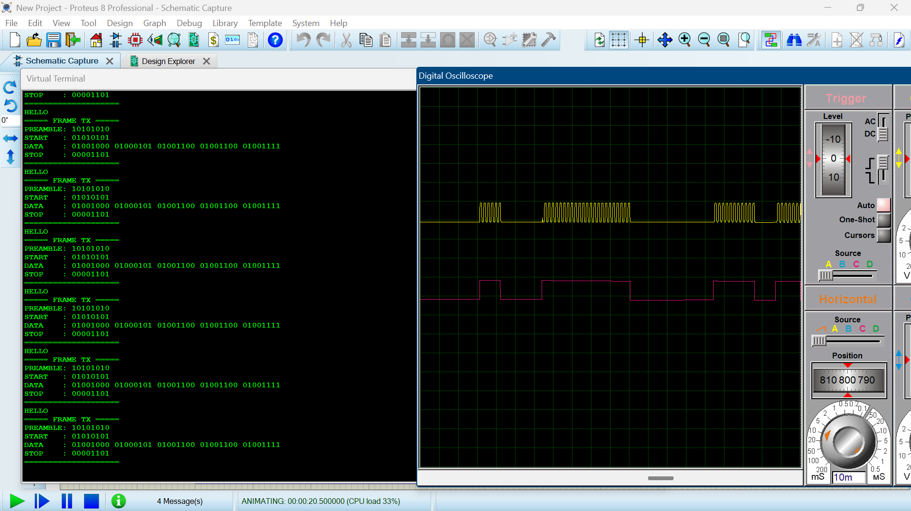
### 4.3. Kết quả thực tế


Sau khi nạp chương trình vào vi điều khiển STM32F103C8T6 và kết nối các module phần cứng, nhóm đã tiến hành đo đạc thực nghiệm để kiểm chứng tính đúng đắn của thuật toán điều chế ASK.

#### a. Kiểm tra tín hiệu vật lý trên Oscilloscope

Sử dụng máy hiện sóng hai kênh để quan sát đồng thời tín hiệu dữ liệu gốc (Baseband) và tín hiệu sau điều chế (ASK Output).

- Kênh 1 (Vàng) - Chân PA0: Tín hiệu điều chế PWM 1kHz. Khi bit 1, xuất hiện các bó xung vuông với biên độ 5V. Khi phóng to (Zoom-in), đo được tần số sóng mang là 1.001 kHz, đúng với cấu hình Timer 2 trong mã nguồn. Trạng thái Bit 0,đường tín hiệu phẳng hoàn toàn ở mức 0V, không có hiện tượng nhiễu trắng hay rò rỉ sóng mang (Carrier Leakage), cho thấy chế độ OOK hoạt động triệt để.


- Kênh 2 (Tím) - Chân PA5: Tín hiệu Digital Output phản ánh chuỗi bit dữ liệu. Mỗi xung vuông (mức cao 5V) có độ rộng ổn định là 10.02ms. Điều này chứng minh hàm HAL_Delay() và xung nhịp hệ thống hoạt động chính xác.

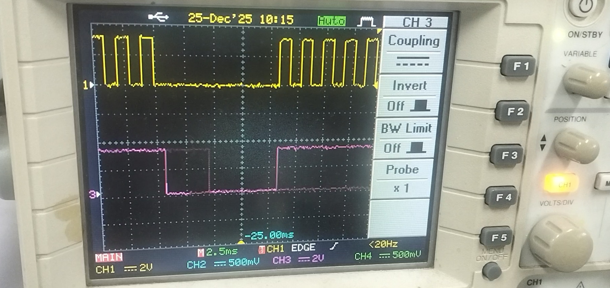

#### b. Kiểm tra cấu trúc khung tin

Bằng cách phân tích chuỗi xung trên Oscilloscope, nhóm đã giải mã ngược lại trình tự gửi dữ liệu:

- Vùng Preamble: 8 chu kỳ bật/tắt liên tục (0xAA) xuất hiện đầu tiên để ổn định bộ nhận.

- Vùng Start Byte: Mã 0x55 xuất hiện ngay sau đó, đánh dấu điểm bắt đầu đồng bộ hóa.

- Vùng Payload: Các ký tự ASCII của chuỗi "HELLO" được truyền đi với bit MSB (bit có trọng số cao nhất) đứng trước.

- Vùng Stop Byte: Kết thúc bằng ký tự \r (0x0D), kéo dài thời gian nghỉ trước khi lặp lại khung mới.

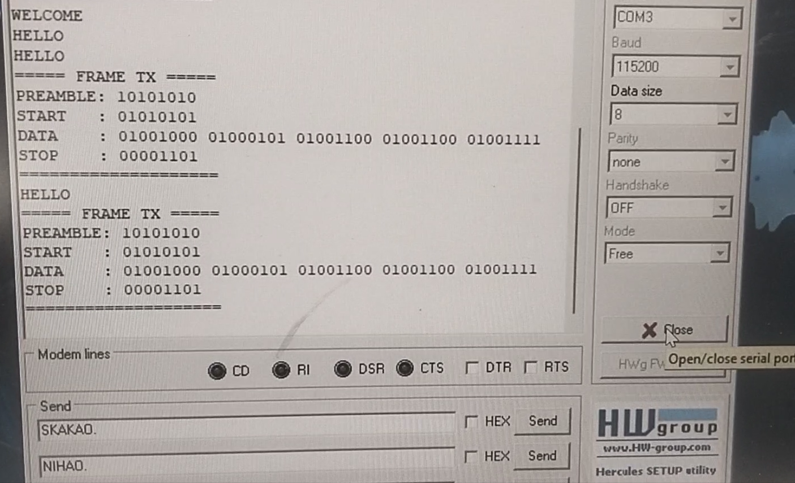


#### c. Kiểm tra giao tiếp UART và Cập nhật dữ liệu động


Sử dụng module CH340 kết nối với phần mềm máy tính Hercules để kiểm tra khả năng tương tác:

- Tốc độ phản hồi: Thiết lập Baudrate 115200 trên máy tính cho kết quả hiển thị ký tự rõ ràng, không bị lỗi font hay mất byte.


- Khả năng thay đổi nội dung: Khi nhập chuỗi: "NIHAO." và nhấn Enter, Ngay lập tức, dạng sóng trên Oscilloscope thay đổi cấu trúc phần Payload theo mã ASCII của chữ "N-I-H-A-O".

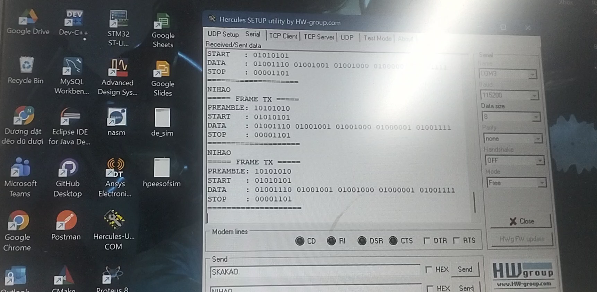


## 5. Nhận xét và đánh giá

### 5.1. Nhận xét kết quả thực hiện 

Thông qua quá trình nghiên cứu lý thuyết, triển khai mã nguồn trên hệ sinh thái STM32 và thực nghiệm đo đạc, ta có thể đưa ra các nhận xét cụ thể như sau:

- Việc sử dụng bộ định thời Timer 2 để tạo sóng mang PWM thay vì các vòng lặp phần mềm (software delay) đã giúp tần số sóng mang đạt độ ổn định tuyệt đối tại 1kHz.

- Phương pháp Unipolar ASK (OOK) đã được hiện thực hóa thành công. Tín hiệu tại chân PA0 thể hiện rõ sự tương quan giữa dữ liệu gốc và sóng mang: khi bit dữ liệu là '1', sóng mang được phát đi với biên độ tối đa; khi bit là '0', hệ thống ngắt hoàn toàn tín hiệu.

- Cơ chế ngắt UART (Interrupt) kết hợp với bộ đệm tạm (buffer) hoạt động hiệu quả. Hệ thống có khả năng xử lý song song: vừa duy trì luồng phát vô tuyến liên tục, vừa sẵn sàng tiếp nhận và cập nhật thông điệp mới từ máy tính thông qua module CH340 mà không làm gián đoạn khung tin đang truyền.

- Việc áp dụng cấu trúc khung bao gồm Preamble (0xAA) và Start Byte (0x55) là một quyết định kỹ thuật đúng đắn. Trong thực tế đo đạc, các thành phần này giúp bộ thu dễ dàng phân biệt giữa nhiễu môi trường và dữ liệu thực, từ đó nâng cao độ tin cậy của hệ thống.


### 5.2. Ưu điểm và hạn chế 

Về các ưu điểm:

- Kiến trúc tối ưu: Tận dụng tối đa sức mạnh của lõi ARM Cortex-M3 để quản lý ngoại vi phức tạp nhưng vẫn đảm bảo code tường minh, dễ bảo trì.

- Giao diện thân thiện: Người dùng dễ dàng cấu hình nội dung phát thông qua các phần mềm Terminal phổ biến mà không cần chuyên môn sâu về lập trình nhúng.

- Chi phí thấp: Sử dụng các linh kiện phổ thông (Blue Pill, CH340, module RF 433MHz) nhưng vẫn đạt được hiệu quả giáo khoa cao trong việc minh họa lý thuyết điều chế biên độ. 


Các hạn chế còn tồn tại:

- Do sử dụng xung vuông làm sóng mang, tín hiệu vẫn chứa các hài bậc cao. Mặc dù đã có thể cải thiện bằng bộ lọc RC, nhưng phổ tín hiệu vẫn chưa thực sự "sạch" như các bộ phát chuyên dụng sử dụng mạch dao động hình sin.


- Tốc độ 100 bps là khá thấp so với nhu cầu truyền tải dữ liệu hiện đại, chủ yếu phục vụ mục đích trình diễn nguyên lý và quan sát trên máy đo oscilloscope.


### 5.2. Kết luận chung

Dự án "Hệ thống phát tín hiệu điều chế ASK sử dụng STM32F103C8T6" đã cơ bản hoàn thành  các mục tiêu đề ra. Về mặt lý thuyết, dự án đã hệ thống hóa được quy trình số hóa và điều chế tín hiệu. Về mặt thực hành, ta đã xây dựng thành công một bộ phát ASK hoạt động ổn định, có khả năng tùy biến thông điệp linh hoạt qua giao tiếp UART.

Đây là nền tảng quan trọng để phát triển các ứng dụng xa hơn. Dự án không chỉ dừng lại ở một bài tập kỹ thuật mà còn giúp người thực hiện hiểu sâu hơn về bản chất vật lý của sóng vô tuyến và cách thức điều khiển chúng thông qua vi điều khiển hiện đại.

